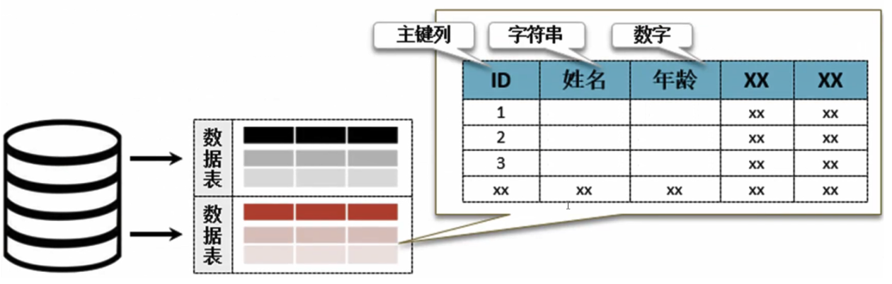
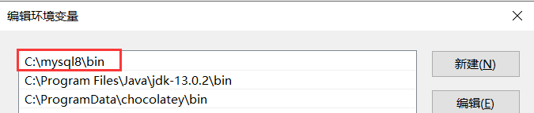

<center><h1>数据库</h1></center>

<div style="border-bottom: none;"><center><h3>目录</h3></center></div>

[TOC]

<div style="page-break-after: always;"></div>

# 第1节 数据库简介

**数据库（Database）**

当今的程序开发几乎都是围绕着数据库展开的，一个合理且通用的程序一定要有数据库的开发支持。

数据库的产生最初是由IBM的一个分析人员在70年代推出的《论关系型数据库的发展》论文开始的。这篇论文一公布之后，全世界就出现了几十种不同的数据库，其中到现在还能够继续存在的数据库是`Oracle`，而其它的数据库要么被收购了，要么就是彻底消失了。后来IBM为了统一数据库操作，后来又推出了`SQL`语法结构，并且该结构也已经成为当今数据库的使用标准。


**SQL（Structured Query Language）**

`SQL`是一种结构化查询语言，用于数据库的访问，自1970年代诞生到现在，经久不衰，日久弥新。数据库早已遍布各个应用领域，数据管理、数据分析甚至机器学习都可以用`SQL`来完成。

`SQL`可用于在数据库中增加、删除、修改、查询数据，用于简单的数据清洗和数据分析，并可搭配其它工具制作数据报表、大数据和机器学习。

关系数据库管理系统`RDBMS (Relational Database Management System)`是一种数据库软件，它将数据和数据关系以数据库和数据表的形式存储，并提供`SQL`访问接口。目前主流的`RDBMS`有`MySQL`、`PostgreSQL`、`SQL Server`和`Oracle`，其中`MySQL`和`PostgreSQL`是免费开源且使用广泛的数据库。

`SQL`的关键字不区分大小写，如`CREATE`和`create`的作用相同，但推荐关键字大写。`SQL`语句中如果包含保留词需要通过转义符转义，例如`MySQL`中的转义符是反引号``。


**SQL语句**

`SQL`是是用来操作数据的基本单位，每一条`SQL`语句末尾必须有分号。

`SQL`可以分为数据操作语言`DML (Data Manipulation Language)`和数据定义语言`DDL (Data Definition Language)`。

`DDL`负责数据结构定义和数据库对象定义，主要由`CREATE`、`ALTER`、`DROP`三个指令组成：

| 指令            | 功能       |
| --------------- | ---------- |
| CREATE DATABASE | 创建数据库 |
| ALTER DATABASE  | 修改数据库 |
| CREATE TABLE    | 创建数据表 |
| ALTER TABLE     | 修改数据表 |
| DROP DATABASE   | 删除数据库 |
| DROP TABLE      | 删除数据表 |

`DML`负责数据访问和数据操作，主要由`INSERT`、`DELETE`、`SELECT`、`UPDATE`组成：

| 指令        | 功能     |
| ----------- | -------- |
| SELECT FROM | 查询数据 |
| UPDATE SET  | 更新数据 |
| DELETE FROM | 删除数据 |
| INSERT INTO | 新增数据 |


**数据类型**

数据库之中最基本的数据管理单位是数据表，每一个数据表中会存在若干个数据列，每一种数据列都有各自对应的数据类型。



数据表中的每个字段都需要明确地指明数据类型。常见的数据类型包括数值型、字符型和日期型。

数值型分为整数类型和小数类型两类：

1. 整数类型默认有符号，无符号需要使用`unsigned`关键字约束，约束后不可表示负数。整数类型有数据长度的限制，如果在数据插入时超出其整型范围，数据库会报异常并插入失败。整数类型可以接受一个参数，表示它的最大显示宽度。
2. 小数类型由整数部分和小数部分组成，指定时可以传入两个参数，分别表示整体的长度和小数部分的长度。

| 数据类型         | 字节 | 描述         |
| ---------------- | :--: | ------------ |
| tinyint(size)    |  1   | 极小整型     |
| smallint(size)   |  2   | 小整型       |
| mediumint(size)  |  3   | 中整型       |
| int(size)        |  4   | 整型         |
| bigint(size)     |  8   | 大整型       |
| float(size, d)   |  4   | 单精度浮点数 |
| double(size, d)  |  8   | 双精度浮点数 |
| decimal(size, d) |  8   | 货币类型     |
| numeric(size, d) |  8   | 同decimal    |

字符类型表示文本和字符，根据字符串的长度，可以分为短文本和长文本两类。常见的短文本类型有`char`（不可变长）和`varchar`（可变长），长本文有`text`和`blob`，其中`blob`用来保存二进制流数据。

| 数据类型      | 可否变长 | 描述                         |
| ------------- | :------: | ---------------------------- |
| char(size)    |   不可   | 固定长度短字符串             |
| varchar(size) |   可以   | 不固定长度短字符串           |
| text          |   可以   | 长字符串，保存文章内容       |
| blob          |   可以   | 二进制流，保存图片、媒体信息 |

<div style="page-break-after: always;"></div>

# 第2节 MySQL安装配置

**MySQL**

`MySQL`是一款开源的关系型数据库，并且使用的人群众多，国内许多的开发公司为了节约软件开发成本，往往会使用大量免费开源的工具，所以`MySQL`这种小巧而且免费的数据库就非常受欢迎。随着`MySQL`版本的不断提升，很多的功能也在不断完善。

MySQL软件可直接通过官方网址（<https://dev.mysql.com/downloads/mysql/8.0.html>）进行下载。


选择默认的Windows系统即可（尽量使用Win10系统安装，如果使用的是老系统往往需要安装大量的系统补丁）。


`MySQL`安装步骤：

1. 解压缩：建议将其解压缩到C盘根目录下，为了方便配置，将文件夹重命名为`mysql8`（完整路径：C:\mysql8）。
2. 路径配置：修改本地`PATH`环境属性，添加`MySQL`可执行文件路径。



3. 数据目录：`MySQL`所提供的仅仅是一个软件支持，但是数据库本身一定需要进行数据存储，就需要为其创建存储目录`D:\mysql-dc\data`和`D:\mysql-dc\logs`，其中`data`保存真实数据，`logs`保存相关日志。
4. `MySQL`配置：通过配置文件`my.ini`建立`C:\mysql8”和“D:\mysql-dc`两个目录之间的联系。


---

【代码】创建my.ini文件

```ini
[mysqld]
# 设置3306端口
port=3306
# 设置mysql的安装目录
basedir=C:\mysql8
# 设置mysql数据库的数据的存放目录
datadir=D:\mysql-dc\data
# mysqlsock存储目录
socket=D:\mysql-dc\data\mysql.sock
# 允许最大连接数
max_connections=10000
# 允许连接失败的次数。这是为了防止有人从该主机试图攻击数据库系统
max_connect_errors=10
# 服务端使用的字符集默认为UTF8
character-set-server=UTF8MB4
# 创建新表时将使用的默认存储引擎
default-storage-engine=INNODB
# 默认使用"mysql_native_password"插件认证
default_authentication_plugin=mysql_native_password
[mysql]
# 设置mysql客户端默认字符集
default-character-set=UTF8MB4
# mysqlsock存储目录
socket=D:\mysql-dc\data\mysql.sock
[client]
# 设置mysql客户端连接服务端时默认使用的端口
port=3306
default-character-set=utf8
[mysqld_safe]
log-error=D:\mysql-dc\logs\mysql.log
pid-file=D:\mysql-dc\logs\mysql.pid
# mysqlsock存储目录
socket=D:\mysql-dc\data\mysql.sock
```

---

5. 数据库初始化：在命令行中通过`MySQL`提供的命令生成结构性文件，数据库初始化的时候会自动生成一个临时的密码，在没有修改之前只能通过此密码进行`MySQL`数据库的访问。

---

【代码】数据库初始化

```mysql
mysqld --initialize --console
```

> 运行结果

```
2021-01-28T13:46:42.116260Z 0 [System] [MY-013169] [Server] C:\mysql8\bin\mysqld.exe (mysqld 8.0.23) initializing of server in progress as process 21148
2021-01-28T13:46:42.180767Z 1 [System] [MY-013576] [InnoDB] InnoDB initialization has started.
2021-01-28T13:46:52.815787Z 1 [System] [MY-013577] [InnoDB] InnoDB initialization has ended.
2021-01-28T13:47:09.573119Z 6 [Note] [MY-010454] [Server] A temporary password is generated for root@localhost: ah+K3SB2,B(B
```

> 临时密码：ah+K3SB2,B(B

---

6. 服务安装：将`MySQL`启动命令添加到服务之中。在进行服务安装的时候一般都需要管理员的操作权限，所以一定要以管理员的身份打开命令行工具，否则会出现`Install/Remove of the Service Denied!`错误信息。

---

【代码】安装并开启服务

```mysql
mysqld install
net start mysql
```

---

7. 服务登录：通过命令行的模式进行`MySQL`数据库登录。第一次密码为系统初始化时生成的临时密码。

---

【代码】MySQL登录

```mysql
mysql -uroot -pah+K3SB2,B(B
```

---

8. 修改密码：将临时密码修改为自己的密码，将`root`超级管理员的密码设置为`mysqladmin`。

---

【代码】修改密码

```mysql
alter user 'root'@'localhost' IDENTIFIED WITH mysql_native_password BY 'mysqladmin';
```

---

9. 远程登录配置：此时的`root`账户只能够在本地进行登录访问，所以需要开启远程访问配置。

---

【代码】远程登录配置

```mysql
# 进入配置数据库
use mysql
# 设置远程访问
update user set user.Host='%' where user.User='root';
# 配置立即生效
flush privileges;
```

---

`MySQL`数据库需要通过命令的模式来完成，要想使用`MySQL`数据库就必须通过用户名和密码进行数据库的登录。

---

【代码】数据库登录

```mysql
mysql -uroot -pmysqladmin
```

---

在一个数据库平台上会存在许多的数据库，通过`SHOW DATABASES;`可以查看当前环境下所有已经存在的数据库信息。

---

【代码】查看数据库

```mysql
SHOW DATABASES;
```

> 运行结果

```
+--------------------+
| Database           |
+--------------------+
| information_schema |
| mysql              |
| performance_schema |
| sys                |
+--------------------+
```

---

<div style="page-break-after: always;"></div>

# 第3节 CREATE

**创建数据库**

`CREATE`负责数据库对象的创建，数据库、数据表、数据库索引、函数等都可以使用`CREATE`来创建。

既然在一个平台上会有许多的数据库，那么在使用的时候就必须明确地确定好一个数据库，通过USE命令来进行数据库的使用切换。

```mysql
CREATE DATABASE [database_name];
USE [database_name];
```

---

【代码】创建student数据库

```mysql
CREATE DATABASE student;
USE student;
```

---

SQL语句可以保存到`.sql`脚本中，在连接MySQL数据库后使用`source`指定脚本路径。

```mysql
source [path]
```


**创建数据表**

`CREATE TABLE`指令可以在数据库中创建数据表。通过`DESC`指令可以查看数据表结构。

```mysql
CREATE TABLE [table_name](
    [col1] [datatype1],
    [col2] [datatype2],
    [col3] [datatype3],
    ....
);

DESC [table_name];
```

---

【代码】创建info数据表，字段包括id、name、gpa

```mysql
CREATE TABLE info(
    id int, 
    name varchar(16), 
    gpa double(5, 2)
);

DESC info;
```

> 运行结果

```
+-------+-------------+------+-----+---------+-------+
| Field | Type        | Null | Key | Default | Extra |
+-------+-------------+------+-----+---------+-------+
| id    | int         | YES  |     | NULL    |       |
| name  | varchar(16) | YES  |     | NULL    |       |
| gpa   | double(5,2) | YES  |     | NULL    |       |
+-------+-------------+------+-----+---------+-------+
```

---

`NULL`是对未知/缺失属性的标识，常用于表示某个字段为空，`NULL`是所有可以为空字段的默认值。

`NULL`必须使用运算符`IS`和`IS NOT`进行比较。`NULL`与`0`并不是等价的，它们无法比较。


**约束（Constraint）**

SQL约束用于在新建或修改数据表时，给数据表或数据表中的字段加上约束条件。约束既可以在字段上，也可以在表上。一个字段，或者一张表可以有多个约束。

```mysql
CREATE TABLE [table_name](
    [col1] [datatype1] [constraint1],
    [col2] [datatype2] [constraint2],
    [col3] [datatype3] [constraint3],
    ....,
    [constraint4]
);
```

|    约束     |    功能    |
| :---------: | :--------: |
|  NOT NULL   |  字段非空  |
|   DEFAULT   | 字段默认值 |
|   UNIQUE    |  字段唯一  |
| PRIMARY KEY |    主键    |
| FOREIGN KEY |    外键    |
|    CHECK    |  校验字段  |

- `DEFAULT`会给字段添加上默认值，若字段在添加的时候没有指定值，则使用默认值。

- `NOT NULL`表示一个字段是非空的，当在插入或者修改时，如果字段为空则报错。

- `PRIMARY KEY`表示主键，用于唯一标识数据表中的每一条记录。主键不能为空，并且必须是唯一的，即每条记录的主键必须各不相同。

- `UNIQUE`用于唯一数据表中的每一条记录，`UNIQUE`约束的字段必须是唯一的，即该字段在每条记录中必须各不相同。`PRIMARY KEY`约束默认拥有`UNIQUE`约束。每个表可以有多个`UNIQUE`约束，但是只能有一个`PRIMARY KEY`。

在数据表已经存在的情况下不能重复创建同名表，因此需要使用`DROP`语句删除已经存在的数据表。

---

【代码】创建info数据表，字段包括id、name、gpa，其中id为主键，name为非空字段，gpa默认为0

```mysql
DROP TABLE IF EXISTS info;

CREATE TABLE info(
    id int PRIMARY KEY,
    name varchar(16) NOT NULL,
    gpa double(5, 2) DEFAULT 0
);

DESC info;
```

> 运行结果

```
+-------+-------------+------+-----+---------+-------+
| Field | Type        | Null | Key | Default | Extra |
+-------+-------------+------+-----+---------+-------+
| id    | int         | NO   | PRI | NULL    |       |
| name  | varchar(16) | NO   |     | NULL    |       |
| gpa   | double(5,2) | YES  |     | 0.00    |       |
+-------+-------------+------+-----+---------+-------+
```

---


**CHECK**

`CHECK`约束用于限制字段值的范围，既可以定义在单个字段上，也可以在定义在表上对特定字段进行约束。`CHECK`可以在数据库层面上筛选掉不符合约束的数据。创建成功后，若插入的数据不满足条件，会导致插入失败。

---

【代码】创建数据表info，包括id、name、age三个，age字段添加CHECK约束，规定所有age必须大于0

```mysql
DROP TABLE IF EXISTS info;

CREATE TABLE info(
    id int,
    name varchar(20),
    age int unsigned CHECK(age > 0)
);

DESC info;
```

> 运行结果

```
+-------+--------------+------+-----+---------+-------+
| Field | Type         | Null | Key | Default | Extra |
+-------+--------------+------+-----+---------+-------+
| id    | int          | YES  |     | NULL    |       |
| name  | varchar(20)  | YES  |     | NULL    |       |
| age   | int unsigned | YES  |     | NULL    |       |
+-------+--------------+------+-----+---------+-------+
```

---

<div style="page-break-after: always;"></div>

# 第4节 ALTER

**初始数据**

---

【代码】初始数据

```mysql
DROP TABLE IF EXISTS info;

CREATE TABLE info(
    id int, 
    name varchar(16), 
    gpa double(5, 2)
);
```

---


**ALTER**

`ALTER`指令用于已有数据表的修改，增加、修改和删除数据表字段都可以通过`ALTER`来完成。`ALTER`使用户可以修改已创建的数据表，但大多数情况下数据表字段和类型需要在定义的时候就确认，`ALTER`修改数据表是非常消耗性能和时间的。

添加、删除、修改字段语法如下：

```mysql
ALTER TABLE [table_name] ADD ([col] [datatype]);
ALTER TABLE [table_name] DROP [col];
ALTER TABLE [table_name] MODIFY (COLUMN [col] [datatype] [constraint]);
```

---

【代码】为info表添加字段phone，类型为varchar(20)；删除字段gpa；修改字段id类型为varchar(10)，字段非空

```mysql
ALTER TABLE info ADD phone varchar(20);
ALTER TABLE info DROP gpa;
ALTER TABLE info MODIFY id varchar(10) NOT NULL;
DESC info;
```

> 运行结果

```
+-------+-------------+------+-----+---------+-------+
| Field | Type        | Null | Key | Default | Extra |
+-------+-------------+------+-----+---------+-------+
| id    | varchar(10) | NO   |     | NULL    |       |
| name  | varchar(16) | YES  |     | NULL    |       |
| phone | varchar(20) | YES  |     | NULL    |       |
+-------+-------------+------+-----+---------+-------+
```

---

<div style="page-break-after: always;"></div>

# 第5节 DROP

**DROP**

`DROP`指令用于删除数据库、数据表、索引和视图等，`DROP`强大而又危险，它能迅速清理掉数据库垃圾，不过使用之前请仔细斟酌，删除的数据很可能再也找不回来了。`DROP`几乎可以清理掉数据库中的任何对象，因此在操作之前必须确保数据的安全性。

删除数据库、诉苦表语法如下：

```mysql
DROP DATABASE [db_name];
DROP TABLE [table_name];
```

`TRUNCATE`指令可以在保留数据表的情况下清空数据表数据。

```mysql
TRUNCATE TABLE [table_name];
```

<div style="page-break-after: always;"></div>

# 第6节 INSERT

**初始数据**

---

【代码】初始数据

```mysql
DROP TABLE IF EXISTS info;

CREATE TABLE info(
    id int,
    name varchar(16),
    gpa double(5, 2)
);
```

---


**INSERT**

`INSERT`指令用于向数据表中添加记录，`INSERT`插入数据分为普通插入和批量插入。并不是每个`RDBMS`都支持批量插入，批量插入的移植性并不好，如果所使用的数据库不支持，可以将其改为多个普通插入。

```mysql
INSERT INTO [table_name] ([col1], [col2]) VALUES([val1], [val2]);
```

如果插入的数据是全字段，那么可以省略前面的`col`。

```mysql
INSERT INTO [table_name] VALUES([val1], [val2]);
```

---

【代码】向数据表info中插入一条记录，id为1，name为Terry，gpa为3.7

```mysql
INSERT INTO info VALUES(1, "Terry", 3.7);
SELECT * FROM info;
```

> 运行结果

```
+------+-------+------+
| id   | name  | gpa  |
+------+-------+------+
|    1 | Terry | 3.70 |
+------+-------+------+
```

---

批量插入与普通插入的区别在于，`VALUES`关键字后面接受多个字段元组，每个`()`代表一个字段元组，一个字段元组会生成一条记录。

```mysql
INSERT INTO [table_name] ([col1], [col2]) VALUES
([val1], [val2]),
([val1], [val2]);
```

---

【代码】向info表中插入两条记录，第一条记录{2, "Lily", 4.2}，第二条记录{3, "Eric", 3.3}

```mysql
INSERT INTO info VALUES (2, "Lily", 4.2), (3, "Eric", 3.3);
SELECT * FROM info;
```

> 运行结果

```
+------+-------+------+
| id   | name  | gpa  |
+------+-------+------+
|    1 | Terry | 3.70 |
|    2 | Lily  | 4.20 |
|    3 | Eric  | 3.30 |
+------+-------+------+
```

---

<div style="page-break-after: always;"></div>

# 第7节 SELECT

**初始数据**

---

【代码】初始数据

```mysql
DROP TABLE IF EXISTS info;

CREATE TABLE info(
    id int,
    name varchar(16),
    gpa double(5, 2)
);

INSERT INTO info VALUES
(1, "Terry", 3.7),
(2, "Lily", 4.2),
(3, "Eric", 3.3),
(4, "Alice", 3.6),
(5, "Lily", 4.2),
(6, "Terry", 3.7),
(7, "Anna", 4.1),
(8, "Jason", 3.9);
```

---


**查询数据库信息**

`SELECT`指令用于查询数据库中的数据，通过`SELECT`可以快速获取数据库中的变量和信息。

---

【代码】获取数据库版本和用户信息

```mysql
SELECT version();
SELECT current_user;
```

> 运行结果

```
+-----------+
| version() |
+-----------+
| 8.0.26    |
+-----------+

+--------------+
| current_user |
+--------------+
| root@%       |
+--------------+
```

---


**查询数据表数据**

大部分情况下，`SELECT`都是用来获取数据表数据。

```mysql
SELECT [col1], [col2] FROM [table_name];
```

`SELECT`后面跟的是要查询的字段名，若是查询所有字段，可以使用`*`表示。但是即使是获取全字段，也不推荐使用`*`，显式地给出查询字段，更容易维护和合作。

```mysql
SELECT * FROM [table_name];
```

---

【代码】查询info表中name和gpa字段

```mysql
SELECT name, gpa FROM info;
```

> 运行结果

```
+-------+------+
| name  | gpa  |
+-------+------+
| Terry | 3.70 |
| Lily  | 4.20 |
| Eric  | 3.30 |
| Alice | 3.60 |
| Lily  | 4.20 |
| Terry | 3.70 |
| Anna  | 4.10 |
| Jason | 3.90 |
+-------+------+
```

---

有时查询出来的所有数据会很多，`SELECT`在查询的时候可以使用`LIMIT`指定条数。

```mysql
SELECT [col1], [col2] FROM [table_name] LIMIT n;
```

有时想要查询指定起始位置指定条数的结果集，起始位置默认为0。

```mysql
SELECT [col1], [col2] FROM [table_name] LIMIT start_pos, n;
```

使用`AS`指令可以为表名或列明指定别名， 在显示结果时使字段名称更具有可读性。

---

【代码】查询info表中前4条数据

```mysql
SELECT name AS student_name, gpa FROM info LIMIT 4;
```

> 运行结果

```
+--------------+------+
| student_name | gpa  |
+--------------+------+
| Terry        | 3.70 |
| Lily         | 4.20 |
| Eric         | 3.30 |
| Alice        | 3.60 |
+--------------+------+
```

---


**DISTINCT**

有时候查询结果中会包含重复的信息，`DISTINCT`关键字用于返回去重后的数据，但是`DISTINCT`去掉重复值带来的时间损耗比查询本身更耗时。`DISTINCT`既可以用来修饰单字段，也可以用来修饰多字段。

```mysql
SELECT DISTINCT [col1], [col2] FROM [table_name];
```

---

【代码】去除info表中重复记录

```mysql
SELECT DISTINCT name, gpa FROM info;
```

> 运行结果

```
+-------+------+
| name  | gpa  |
+-------+------+
| Terry | 3.70 |
| Lily  | 4.20 |
| Eric  | 3.30 |
| Alice | 3.60 |
| Anna  | 4.10 |
| Jason | 3.90 |
+-------+------+
```

---


**WHERE**

数据表中的数据往往比较繁杂，在查询的时候需要按照一定的条件进行筛选，`WHERE`指令用于筛选出满足条件的结果集。

`WHERE`后仅有一个条件子句的查询称为单条件查询。

```mysql
SELECT [col1], [col2] from [table_name]WHERE [col] [condition] [val];
```

搭配不同的运算符，可以让`WHERE`的条件过滤变得更为强大。

| 运算符 | 功能                                                         |
| :----: | ------------------------------------------------------------ |
|   >    | 大于                                                         |
|   >=   | 大于等于                                                     |
|   <    | 小于                                                         |
|   <=   | 小于等于                                                     |
|   =    | 等于                                                         |
| !=、<> | 不等于                                                       |
|   !>   | 不大于                                                       |
|   !<   | 不小于                                                       |
|  AND   | 连接两个条件表达式，若二者都为True，返回True，否则返回False  |
|   OR   | 连接两个条件表达式，若二者都为False，返回False，否则返回True |

---

【代码】查询info表中gpa在3.3~3.5之间的学生

```mysql
SELECT * from info WHERE gpa >= 3.3 AND gpa <= 3.6;
```

> 运行结果

```
+------+-------+------+
| id   | name  | gpa  |
+------+-------+------+
|    3 | Eric  | 3.30 |
|    4 | Alice | 3.60 |
+------+-------+------+
```

---

<div style="page-break-after: always;"></div>

# 第8节 ORDER BY

**初始数据**

---

【代码】初始数据

```mysql
DROP TABLE IF EXISTS info;

CREATE TABLE info(
    id int,
    name varchar(20),
    gpa double(5, 2)
);

INSERT INTO info VALUES
(6, "Tina", 3.7),
(1, "Terry", 3.7),
(2, "Lily", 4.2),
(5, "Harry", 4.2),
(4, "Alice", 3.6),
(8, "Jason", 3.9),
(3, "Eric", 3.3),
(7, "Anna", 4.1);
```

---


**ORDER BY**

`ORDER BY`可以根据一个或多个字段对结果集排序，默认按照`ASC`升序排序，降序排序可以指定`DESC`。

多字段排序会优先以第一字段排序后，再排序第二字段。`ORDER BY`对于多字段的排序支持虽然强大，但是很消耗性能。

```mysql
SELECT [col] FROM [table_name]
ORDER BY [col1] [DESC|ASC], [col2] [DESC|ASC];
```

---

【代码】将info表中的学生按照gpa降序排序，gpa相同时以id升序排序

```mysql
SELECT * FROM info ORDER BY gpa DESC, id ASC;
```

> 运行结果

```
+------+-------+------+
| id   | name  | gpa  |
+------+-------+------+
|    2 | Lily  | 4.20 |
|    5 | Harry | 4.20 |
|    7 | Anna  | 4.10 |
|    8 | Jason | 3.90 |
|    1 | Terry | 3.70 |
|    6 | Tina  | 3.70 |
|    4 | Alice | 3.60 |
|    3 | Eric  | 3.30 |
+------+-------+------+
```

---

<div style="page-break-after: always;"></div>

# 第9节 UPDATE

**初始数据**

---

【代码】初始数据

```mysql
DROP TABLE IF EXISTS info;

CREATE TABLE info(
    id int,
    name varchar(16),
    gpa double(5, 2)
);

INSERT INTO info VALUES
(1, "Terry", 3.7),
(2, "Lily", 4.2),
(3, "Eric", 3.3);
```

---


**UPDATE**

`UPDATE`指令用于更新数据库，一般情况下`UPDATE`会和`WHERE`搭配使用。

```mysql
UPDATE [table_name] SET [col] = [val] WHERE [col] = [val];
```

---

【代码】在info表中，将Eric的姓名改为Kris，gpa改为3.4

```mysql
UPDATE info SET name = "Kris", gpa = 3.4 WHERE name = "Eric";
SELECT * FROM info;
```

> 运行结果

```
+------+-------+------+
| id   | name  | gpa  |
+------+-------+------+
|    1 | Terry | 3.70 |
|    2 | Lily  | 4.20 |
|    3 | Kris  | 3.40 |
+------+-------+------+
```

---

<div style="page-break-after: always;"></div>

# 第10节 DELETE

**初始数据**

---

【代码】初始数据

```mysql
DROP TABLE IF EXISTS info;

CREATE TABLE info(
    id int,
    name varchar(16),
    gpa double(5, 2)
);

INSERT INTO info VALUES
(1, "Terry", 3.7),
(2, "Lily", 4.2),
(3, "Eric", 3.3);
```

---


**DELETE**

`DELETE`指令用于删除数据库中的数据，一般情况下`DELETE`会和`WHERE`一起搭配使用，来删除指定数据。

`DELETE`删除的单位是行，即一条记录，而不是用于删除某个字段。

```mysql
DELETE FROM [table_name] WHERE [col] = [val];
```

切勿直接使用`DELETE FROM [table_name]`，这样会直接删除所有的数据。删除数据是一个危险操作，在使用前请慎重考虑。

---

【代码】在info表中删除Eric的记录

```mysql
DELETE FROM info WHERE name = "Eric";
SELECT * FROM info;
```

> 运行结果

```
+------+-------+------+
| id   | name  | gpa  |
+------+-------+------+
|    1 | Terry | 3.70 |
|    2 | Lily  | 4.20 |
+------+-------+------+
```

---

<div style="page-break-after: always;"></div>

# 第11节 LIKE & REGEXP

**初始数据**

---

【代码】初始数据

```mysql
DROP TABLE IF EXISTS info;

CREATE TABLE info(
    id int,
    name varchar(16),
    gpa double(5, 2)
);

INSERT INTO info VALUES
(1, "Terry", 3.7),
(2, "Lily", 4.2),
(3, "Eric", 3.3),
(4, "Alice", 3.6),
(5, "Anna", 4.1),
(6, "Henry", 3.9);
```

---


**LIKE**

很多时候数据表中存储了大量的字符类型字段，`LIKE`操作符可用于搜索和匹配字符字段。`LIKE`一般与`WHERE`搭配使用，表示搜索像某个值的字段。

```mysql
SELECT [col] FROM [table_name] WHERE [col] LIKE [val];
```

通配符是用特殊的字符来表示一个或多个字符，通配符必须和`LIKE`搭配使用。

|    通配符    | 描述                                                    |
| :----------: | ------------------------------------------------------- |
|      %       | 匹配一个或多个字符                                      |
|      _       | 匹配一个字符                                            |
| [char_list]  | char_list是一个字符列表，其匹配列表中的任意一个字符     |
| [^char_list] | char_list是一个字符列表，其匹配不在列表中的任意一个字符 |

注意，`MySQL`与`PostgreSQL`均不支持字符列表通配符，在实际场景中可以使用正则（`REGEXP`）来替代。

---

【代码】在info表中匹配出所有name中第二个字符为“e”，并且以“y”结尾的学生

```mysql
SELECT * FROM info WHERE name LIKE "_e%y";
```

> 运行结果

```
+------+-------+------+
| id   | name  | gpa  |
+------+-------+------+
|    1 | Terry | 3.70 |
|    6 | Henry | 3.90 |
+------+-------+------+
```

---


**REGEXP**

`REGEXP`搭配正则表达式，可用于匹配特定模式下的字符串。与`LIKE`相比，`REGEXP`更加强大，但是性能不如`LIKE`。

```mysql
SELECT [col] FROM [table_name] WHERE [col] REGEXP [val];
```

---

【代码】在info表中匹配所有name以元音开头的学生

```mysql
SELECT * FROM info WHERE name REGEXP "^[AEIOUaeiou]";
```

> 运行结果

```
+------+-------+------+
| id   | name  | gpa  |
+------+-------+------+
|    3 | Eric  | 3.30 |
|    4 | Alice | 3.60 |
|    5 | Anna  | 4.10 |
+------+-------+------+
```

---

<div style="page-break-after: always;"></div>

# 第12节 BETWEEN & IN

**初始数据**

---

【代码】初始数据

```mysql
DROP TABLE IF EXISTS info;

CREATE TABLE info(
    id int,
    name varchar(16),
    gpa double(5, 2)
);

INSERT INTO info VALUES
(1, "Terry", 3.7),
(2, "Lily", 4.2),
(3, "Eric", 3.3),
(4, "Alice", 3.6),
(5, "Anna", 4.1),
(6, "Henry", 3.9);
```

---


**BETWEEN**

有时候数据筛选的条件是一个范围，`BETWEEN`必须与`AND`一起使用，常与`WHERE`搭配用于操作某个范围内的数据。

```mysql
SELECT [col] FROM [table_name]
WHERE [col] BETWEEN [val1] AND [val2];
```

---

【代码】在info表中筛选出gpa在3.7~4.1之间的学生

```mysql
SELECT * FROM info WHERE gpa BETWEEN 3.7 AND 4.1;
```

> 运行结果

```
+------+-------+------+
| id   | name  | gpa  |
+------+-------+------+
|    1 | Terry | 3.70 |
|    5 | Anna  | 4.10 |
|    6 | Henry | 3.90 |
+------+-------+------+
```

---


**IN**

`IN`与`BETWEEN`不同的是，`IN`表示在某个集合之中，且必须罗列出所有的值。

```mysql
SELECT [col] FROM [table_name] WHERE [col] IN (val, ...);
```

如果范围条件是连续的，优先考虑使用`BETWEEN`，不仅语句更为简洁，而且性能更加优异。但是`BETWEEN`只可用于连续范围的操作，而`IN`还支持非连续范围的操作。

---

【代码】在info表中筛选出gpa不为3.3和4.2的学生

```mysql
SELECT * FROM info WHERE gpa NOT IN (3.3, 4.2);
```

> 运行结果

```
+------+-------+------+
| id   | name  | gpa  |
+------+-------+------+
|    1 | Terry | 3.70 |
|    4 | Alice | 3.60 |
|    5 | Anna  | 4.10 |
|    6 | Henry | 3.90 |
+------+-------+------+
```

---

<div style="page-break-after: always;"></div>

# 第13节 UNION

**初始数据**

---

【代码】初始数据

```mysql
DROP TABLE IF EXISTS computer_science;

CREATE TABLE computer_science(
    id int,
    name varchar(20)
);

INSERT INTO computer_science VALUES
(979489, "Terry"),
(102387, "Henry");

DROP TABLE IF EXISTS engineering;

CREATE TABLE engineering(
    id int,
    name varchar(20)
);

INSERT INTO engineering VALUES
(8347201, "Alice"),
(979489, "Terry");
```

---


**UNION**

`UNION`操作符用于合并两个或多个`SELECT`查询的结果集，`UNION`合并的结果集必须拥有相同的字段个数，且合并的字段类型必须兼容。

```mysql
SELECT [col] FROM [table_name1]
UNION
SELECT [col] FROM [table_name2];
```

`UNION`在合并两个结果集时，会默认去掉重复值，如果需要保留重复的记录就需要使用`UNION ALL`。

---

【代码】查询获取computer_science和engineering表中的所有学生

```mysql
SELECT id, name FROM computer_science
UNION
SELECT id, name FROM engineering;
```

> 运行结果

```
+---------+-------+
| id      | name  |
+---------+-------+
|  979489 | Terry |
|  102387 | Henry |
| 8347201 | Alice |
+---------+-------+
```

---

<div style="page-break-after: always;"></div>

# 第14节 date & time

**date & time**

`date`用于存储日期类数据，日期的有效值范围在`1000-01-01 ~ 9999-12-32`之间。

`time`用于存储时间类数据，时间的范围在`-838:59:59.000000 ~ 838:59:59.000000`之间，有效值在`00:00:00 ~ 23:59:59`之间。

`timestamp`用来存储时间戳数据，不仅可以保存日期数据，还可以保存时间数据。SQL中提供了`now()`用于生成当前时间戳。

SQL标准中时间和日期的数据类型主要包括`date`、`time`和`timestamp`，不过在不同数据库中会有所不同，如MySQL中还支持`datetime`来融合`date`和`time`；而在SQL Server中不支持`timestamp`类型，仅支持`datetime`类型。

---

【代码】创建exam日期表

```mysql
DROP TABLE IF EXISTS exam;

CREATE TABLE exam(
    course_name varchar(30),
    exam_date date,
    exam_time time
);

INSERT INTO exam VALUES
("Data Structure", "2021-09-13", "15:30:00"),
("Database", "2021-10-04", "10:20:00"),
("Software Engineering", "2021-09-14", "18:45:00");

SELECT * FROM exam;
```

> 运行结果

```
+----------------------+------------+-----------+
| course_name          | exam_date  | exam_time |
+----------------------+------------+-----------+
| Data Structure       | 2021-09-13 | 15:30:00  |
| Database             | 2021-10-04 | 10:20:00  |
| Software Engineering | 2021-09-14 | 18:45:00  |
+----------------------+------------+-----------+
```

---

<div style="page-break-after: always;"></div>

# 第15节 PRIMARY KEY & FOREIGN KEY

**PRIMARY KEY**

主键`PRIMARY KEY`是数据表中每条记录唯一的标识，每一张表都应有一个主键，主键只能有一个，且不能为空。

我们通常希望在每次插入新记录时，自动地创建主键字段的值。`AUTO_INCREMENT`关键字可以实现字段的自增，默认值为1，每条新记录递增1。不同的数据库对于自增的支持是不同的，有些数据库甚至不支持自增主键。

---

【代码】创建student_info表，设置id为主键，添加AUTO_INCREMENT约束

```mysql
DROP TABLE IF EXISTS student_info;

CREATE TABLE student_info(
    id int unsigned PRIMARY KEY AUTO_INCREMENT,
    name varchar(20)
);

DESC student_info;
```

> 运行结果

```
+------+-------------+-----+----+--------+---------------+
|Field |Type         |Null |Key |Default |Extra          |
+------+-------------+-----+----+--------+---------------+
|id    |int unsigned |NO   |PRI | NULL   |auto_increment |
|name  |varchar(20)  |YES  |    | NULL   |               |
+------+-------------+-----+----+--------+---------------+
```

---


**FOREIGN KEY**

对于关系数据库，最核心的东西莫过于`关系`二字。在开发中，表A的主键一般会作为表B的外键，用来表示表A与表B之间的关系。

外键`FOREIGN KEY`用来表示表与表之间的关系，一般使用另一张表的主键作为外键。

```mysql
FOREIGN KEY ([col1]) REFERENCES [table_name]([col2])
```

---

【代码】创建gpa_info表，设置student_id为外键，关键student_info表的id

```mysql
DROP TABLE IF EXISTS gpa_info;

CREATE TABLE gpa_info(
    id int unsigned PRIMARY KEY AUTO_INCREMENT,
    gpa double(5, 2),
    student_id int unsigned,
    FOREIGN KEY (student_id) REFERENCES student_info(id)
);

DESC gpa_info;
```

> 运行结果

```
+-----------+-------------+-----+----+--------+---------------+
|Field      |Type         |Null |Key |Default |Extra          |
+-----------+-------------+-----+----+--------+---------------+
|id         |int unsigned |NO   |PRI |NULL    |auto_increment |
|gpa        |double(5,2)  |YES  |    |NULL    |               |
|student_id |int unsigned |YES  |MUL |NULL    |               |
+-----------+-------------+-----+----+--------+---------------+
```

---

<div style="page-break-after: always;"></div>

# 第16节 JOIN

**初始数据**

---

【代码】初始数据

```mysql
DROP TABLE IF EXISTS course;

CREATE TABLE course(
    id int PRIMARY KEY,
    name varchar(30)
);

INSERT INTO course VALUES
(1500, "Introduction to C"),
(2520, "Data Structure"),
(3110, "Operating System");

DROP TABLE IF EXISTS student;

CREATE TABLE student(
    id int PRIMARY KEY,
    name varchar(20),
    course_id int REFERENCES course(id)
);

INSERT INTO student VALUES
(979489, "Terry", 2520),
(102453, "Lily", 1500),
(919342, "Henry", 2520),
(235472, "Eric", NULL);
```

---


**JOIN**

`JOIN`语句用于将数据库中的两个或多个表组合起来，连接操作是关系数据库中体现“关系”的核心指令，常用于合并拥有关联关系的两表或者多表，并从中获取数据。

连接操作是使用外键最主要的方式，通过连接可以将两个或多个拥有外键关联的数据表的数据进行合并，然后选择需要的数据字段。

SQL有五种连接方式：

1. 交叉连接（`CROSS JOIN`）
2. 内连接（`INNER JOIN`）
3. 全外连接（`FULL OUTER JOIN`）
4. 左外连接（`LEFT OUTER JOIN`）
5. 右外连接（`RIGHT OUTER JOIN`）


**交叉连接**

交叉连接`CROSS JOIN`，又称笛卡尔连接（Cartesian Join），其作用是返回两表的笛卡尔积。

交叉连接可对任意两表进行连接，即使两表之间不存在关联关系。交叉连接就是将一张表的每一条记录与另一张表的每一条记录进行连接成为一条新记录，排列组合完毕后得到两张表的笛卡尔积。

---

【代码】获取student和course两表的笛卡尔积

```mysql
SELECT * FROM student CROSS JOIN course;
# 交叉连接还可以通过隐式的连接方式实现
# SELECT * FROM student, course;
```

> 运行结果

```
+--------+-------+-----------+------+-------------------+
| id     | name  | course_id | id   | name              |
+--------+-------+-----------+------+-------------------+
| 102453 | Lily  |      1500 | 3110 | Operating System  |
| 102453 | Lily  |      1500 | 2520 | Data Structure    |
| 102453 | Lily  |      1500 | 1500 | Introduction to C |
| 235472 | Eric  |      NULL | 3110 | Operating System  |
| 235472 | Eric  |      NULL | 2520 | Data Structure    |
| 235472 | Eric  |      NULL | 1500 | Introduction to C |
| 919342 | Henry |      2520 | 3110 | Operating System  |
| 919342 | Henry |      2520 | 2520 | Data Structure    |
| 919342 | Henry |      2520 | 1500 | Introduction to C |
| 979489 | Terry |      2520 | 3110 | Operating System  |
| 979489 | Terry |      2520 | 2520 | Data Structure    |
| 979489 | Terry |      2520 | 1500 | Introduction to C |
+--------+-------+-----------+------+-------------------+
```

---


**内连接**

内连接`INNER JOIN`是将一张表的每一条记录与另一张表的每一行记录进行比较，得到两张表匹配的记录集合。


---

【代码】获取student和course两表的内连接集合

```mysql
SELECT * FROM student INNER JOIN course
ON student.course_id = course.id;

# 内连接是默认的连接方式，因此可以省略INNER关键字
# SELECT * FROM student JOIN course
# ON student.course_id = course.id;
```

> 运行结果

```
+--------+-------+-----------+------+-------------------+
| id     | name  | course_id | id   | name              |
+--------+-------+-----------+------+-------------------+
| 102453 | Lily  |      1500 | 1500 | Introduction to C |
| 919342 | Henry |      2520 | 2520 | Data Structure    |
| 979489 | Terry |      2520 | 2520 | Data Structure    |
+--------+-------+-----------+------+-------------------+
```

---


**左外连接**

若A和B两表进行左外连接，会在结果中包含左表（A）的所有记录，即使那些记录在右表（B） 没有符合连接条件相应的匹配记录，未匹配的记录会给予`NULL`填充。


---

【代码】查询stundent表中每一个学生和该学生所选的课程

```mysql
SELECT student.name AS student_name, course.name AS course_name
FROM student LEFT OUTER JOIN course
ON student.course_id = course.id;
```

> 运行结果

```
+--------------+-------------------+
| student_name | course_name       |
+--------------+-------------------+
| Lily         | Introduction to C |
| Eric         | NULL              |
| Henry        | Data Structure    |
| Terry        | Data Structure    |
+--------------+-------------------+
```

---


**右外连接**

若A和B两表进行右外连接，会在结果中包含右表（ B）的所有记录，即使那些记录在左表（A）中没有符合连接条件相应的匹配记录，未匹配的记录会给予`NULL`填充。


---

【代码】查询course表中每一门课和该课程下参与的学生

```mysql
SELECT course.name AS course_name, student.name AS student_name
FROM student RIGHT OUTER JOIN course
ON course.id = student.course_id;
```

> 运行结果

```
+-------------------+--------------+
| course_name       | student_name |
+-------------------+--------------+
| Introduction to C | Lily         |
| Data Structure    | Terry        |
| Data Structure    | Henry        |
| Operating System  | NULL         |
+-------------------+--------------+
```

---

`SQLite`是不支持右连接的，却可以通过更换保留表的位置用左连接来模拟右连接。


**全连接**

全连接是左、右外连接的并集，查询结果会包含被连接表的所有记录，若缺少匹配的记录，将以`NULL`填充。


---

【代码】获取course和student两表的全连接

```sql
SELECT * FROM course FULL OUTER JOIN student
ON course.id = student.course_id;
```

---

一些数据库，比如MySQL是不支持全连接的，但可以通过左、右外连接的并集来模拟实现。

---

【代码】MySQL模拟实现全连接

```mysql
SELECT * FROM student LEFT JOIN course
ON course.id = student.course_id
UNION
SELECT * FROM student RIGHT JOIN course
ON course.id = student.course_id;
```

> 运行结果

```
+--------+-------+-----------+------+-------------------+
| id     | name  | course_id | id   | name              |
+--------+-------+-----------+------+-------------------+
| 102453 | Lily  |      1500 | 1500 | Introduction to C |
| 235472 | Eric  |      NULL | NULL | NULL              |
| 919342 | Henry |      2520 | 2520 | Data Structure    |
| 979489 | Terry |      2520 | 2520 | Data Structure    |
|   NULL | NULL  |      NULL | 3110 | Operating System  |
+--------+-------+-----------+------+-------------------+
```

---


**自连接**

自连接（self join）是一种特殊的连接方式，指的是与自身进行连接。自连接对于别名的要求是必须的，否则解析引擎无法判断出二者之间的关系。

---

【代码】查询employee表中薪资超期其领导的员工

```mysql
DROP DATABASE IF EXISTS employment;
CREATE DATABASE employment;
USE employment;

CREATE TABLE employee(
    id int unsigned PRIMARY KEY AUTO_INCREMENT,
    name varchar(20),
    salary decimal(8, 2),
    manager_id int unsigned
);

INSERT INTO employee VALUES
(1, "Terry", 9000, 3),
(2, "Eric", 8500, 4),
(3, "Henry", 8700, NULL),
(4, "Alice", 8900, NULL);

SELECT a.name
FROM employee AS a
JOIN employee AS b
ON a.manager_id = b.id
WHERE a.salary > b.salary;
```

> 运行结果

```
+-------+
| name  |
+-------+
| Terry |
+-------+
```

---

<div style="page-break-after: always;"></div>

# 第17节 GROUP BY & HAVING

**初始数据**

---

【代码】初始数据

```mysql
DROP TABLE IF EXISTS info;

CREATE TABLE info(
    id int unsigned PRIMARY KEY AUTO_INCREMENT,
    name varchar(20),
    age int unsigned CHECK(age > 0)
);

INSERT INTO info VALUES
(1, "Terry", 23),
(2, "Henry", 22),
(3, "Lily", 23),
(4, "Eric", 18);
```

---


**GROUP BY**

`GROUP BY`用于数据分组，一般与聚合函数一起使用。`GROUP BY`会根据数据字段来分组，并且根据给定的聚合函数对分组进行聚合操作。

```mysql
# [agg]表示聚合函数
SELECT [agg] FROM [table_name] GROUP BY [col];
```

---

【代码】将info表中的学生根据age进行分组，打印每个分组的学生数

```mysql
SELECT name, COUNT(*) FROM info GROUP BY age;
```

> 运行结果

```
+-------+----------+
| name  | COUNT(*) |
+-------+----------+
| Terry |        2 |
| Henry |        1 |
| Eric  |        1 |
+-------+----------+
```

---

MySQL中若出现`ERROR 1055 (42000)`错误，是因为默认开启了`ONLY_FULL_GROUP_BY`选项，需要将其关闭。

```mysql
set sql_mode='STRICT_TRANS_TABLES,NO_ZERO_IN_DATE,NO_ZERO_DATE,ERROR_FOR_DIVISION_BY_ZERO,NO_ENGINE_SUBSTITUTION';
```


**HAVING**

由于`WHERE`无法与聚合函数一起搭配使用，因此SQL增加`HAVING`指令。`HAVING`本身并无其他含义，它的主要功能是替代` WHERE`。

`HAVING`不能单独出现，必须与聚合函数搭配使用，且常与`GROUP BY`一起出现。

```mysql
SELECT [agg] FROM [table_name]
GROUP BY [col] HAVING [condition];
```

---

【代码】将info表中的学生根据age进行分组，打印大于20岁的每个分组人数

```mysql
SELECT age, COUNT(*) FROM info
GROUP BY age HAVING age > 20;
```

> 运行结果

```
+------+----------+
| age  | COUNT(*) |
+------+----------+
|   23 |        2 |
|   22 |        1 |
+------+----------+
```

---

<div style="page-break-after: always;"></div>

# 第18节 子查询

**初始数据**

---

【代码】初始数据

```mysql
DROP TABLE IF EXISTS info;

CREATE TABLE info(
    id int unsigned PRIMARY KEY AUTO_INCREMENT,
    name varchar(20),
    gpa double(5, 2)
);

INSERT INTO info VALUES
(1, "Terry", 3.8),
(2, "Lily", 4.2),
(3, "Eric", 3.4),
(4, "Henry", 3.8);
```

---


**子查询**

子查询又称嵌套查询，是种嵌套在其它SQL查询的`WHERE`子句中的查询。SQL子查询是一种复杂的查询方式，一般子查询语句都可以被分为主查询部分和子查询部分。子查询部分为主查询部分服务，常用于为主查询返回其所需数据，或者进一步筛选主查询数据。

---

【代码】获取info表中小于gpa最高分的所有学生

```mysql
SELECT name FROM info
WHERE gpa <
(SELECT gpa FROM info ORDER BY gpa DESC LIMIT 1);
```

> 运行结果

```
+-------+
| name  |
+-------+
| Terry |
| Eric  |
| Henry |
+-------+
```

---

【代码】将info表中gpa大于3.5分的学生gpa增加0.1

```sql
UPDATE info SET gpa = gpa + 0.1
WHERE id IN
(SELECT id FROM info WHERE gpa > 3.5);

SELECT * FROM info;
```

> 运行结果

```
+----+-------+------+
| id | name  | gpa  |
+----+-------+------+
|  1 | Terry | 3.90 |
|  2 | Lily  | 4.30 |
|  3 | Eric  | 3.40 |
|  4 | Henry | 3.90 |
+----+-------+------+
```

---

MySQL中不支持在同一张表中查询又更新，因此需要改写SQL语句使其支持。

---

【代码】MySQL中实现将info表中gpa大于3.5分的学生gpa增加0.1

```mysql
UPDATE info SET gpa = gpa + 0.1
WHERE id IN (
SELECT a.id FROM
(SELECT id FROM info WHERE gpa > 3.5)
AS a
);

SELECT * FROM info;
```

> 运行结果

```
+----+-------+------+
| id | name  | gpa  |
+----+-------+------+
|  1 | Terry | 3.90 |
|  2 | Lily  | 4.30 |
|  3 | Eric  | 3.40 |
|  4 | Henry | 3.90 |
+----+-------+------+
```

---

<div style="page-break-after: always;"></div>

# 第19节 ANY & ALL

**初始数据**

---

【代码】初始数据

```mysql
DROP TABLE IF EXISTS class_1;

CREATE TABLE class_1(
    id int unsigned PRIMARY KEY AUTO_INCREMENT,
    name varchar(20),
    gpa double(5, 2)
);

INSERT INTO class_1 VALUES
(1, "Terry", 3.8),
(2, "Lily", 4.2),
(3, "Henry", 3.2);

DROP TABLE IF EXISTS class_2;

CREATE TABLE class_2(
    id int unsigned PRIMARY KEY AUTO_INCREMENT,
    name varchar(20),
    gpa double(5, 2)
);

INSERT INTO class_2 VALUES
(1, "Eric", 3.4),
(2, "Alce", 4.2),
(3, "Shawn", 3.5);
```

---


**ANY & ALL**

如果子查询返回多条记录，那么主查询部分只能使用多值比较符（如`IN`），对于单值比较符（如`>`）则无法工作。

`ANY`和`ALL`主要解决子查询返回多条记录而主查询需要使用单值比较符的问题。

| 作用 | 说明                                 |
| :--: | ------------------------------------ |
| ANY  | 子查询结果集任一条记录满足比较符即可 |
| ALL  | 子查询结果集所有记录满足比较符才可   |

---

【代码】查询class_1中gpa低于class_2中任意一个的同学

```mysql
SELECT name, gpa FROM class_1
WHERE gpa < ANY
(SELECT gpa FROM class_2);
```

> 运行结果

```
+-------+------+
| name  | gpa  |
+-------+------+
| Terry | 3.80 |
| Henry | 3.20 |
+-------+------+
```

---

【代码】查询class_1中gpa低于class_2中所有人的同学

```mysql
SELECT name, gpa FROM class_1
WHERE gpa < ALL
(SELECT gpa FROM class_2);
```

> 运行结果

```
+-------+------+
| name  | gpa  |
+-------+------+
| Henry | 3.20 |
+-------+------+
```

---

<div style="page-break-after: always;"></div>

# 第20节 事务

**事务（Transaction）**

事务是数据库中的核心概念，指的是将数据库的一组操作作为一个整体，要么全部执行，要么都不执行。并不是每个数据库引擎都支持事务，如MySQL的`MyISAM`引擎就不支持事务。

事务具有四大特性，即`ACID`：

1. 原子性（atomicity）：每个事务都是一个整体，不可再拆分，事务中的操作要么全部执行成功，要么全部失败。
2. 一致性（consistency）：事务执行前后数据库的状态必须保持一致。如 A 转账给 B，转账后金额的总数是不变的。
3. 隔离性（isolation）：事务与事务之间互不影响，彼此隔离。
4. 持久性（durability）：事务一旦提交成功，对数据库的更改就是永久的，即使出现了其它情况，数据改变仍然存在。

事务的四大特性是事务最本质的特点，在这四个特性中，原子性是基础，隔离性是手段，一致性是约束条件，持久性是目的。

| 事务控制语句                      | 描述                                                         |
| --------------------------------- | ------------------------------------------------------------ |
| START TRANSACTION或BEGIN          | 显式地开始一个事务                                           |
| COMMIT                            | 提交事务                                                     |
| SAVEPOINT                         | 创建保存点，一个事务可以有多个保存点，事务可以根据保存点进行回滚 |
| ROLLBACK或ROLLBACK TO [SAVEPOINT] | 回滚事务，默认回滚所有更改，如果加上保存点，则回滚到保存点   |
| RELEASE SAVEPOINT                 | 删除保存点，保存点被删除后，不可回滚                         |
| SET TRANSACTION                   | 设置事务的隔离级别                                           |


**并发异常**

在实际开发中，大量的并发会导致数据的竞争，从而引起一系列的并发问题。

SQL标准共定义了三种并发异常：

1. 脏读（dirty read）：读到了其它事务还未提交的数据。

    > A正在访问数据库，开启了一个事务，向info表中插入了一条记录：
    >
    > ```mysql
    > BEGIN;
    > INSERT INTO info VALUES (4, "Tina", 3.0);
    > ```
    >
    > A还未提交事务，但B此时却访问了数据库，并且查询了info表：
    >
    > ```mysql
    > SELECT * FROM info;
    > ```
    >
    > B获取到了如下信息：
    >
    > ```
    > +----+-------+------+
    > | id | name  | gpa  |
    > +----+-------+------+
    > |  4 | Tina  | 3.00 |
    > +----+-------+------+
    > ```
    >
    > A明明还没有提交事务，但B却已经看到了A操作的结果。试想一下，如果此时A回滚了事务，那么对于B来说，他就看到了脏数据。

2. 不可重复读（nonrepeatable read）：两次读到了同一数据的不同结果。

    > A正在访问数据库，他查看了info表中id为4的学生：
    >
    > ```mysql
    > SELECT * FROM info WHERE id = 4;
    > ```
    >
    > ```
    > +----+-------+------+
    > | id | name  | gpa  |
    > +----+-------+------+
    > |  4 | Tina  | 3.00 |
    > +----+-------+------+
    > ```
    >
    > 此时B也访问了数据库，他开启了一个事务，并修改了id为4的学生：
    >
    > ```mysql
    > BEGIN;
    > UPDATE info SET gpa = gpa + 0.1 WHERE id = 4;
    > ```
    >
    > A再次查看了一次id为4的学生：
    >
    > ```mysql
    > SELECT * FROM info WHERE id = 4;
    > ```
    >
    > ```
    > +----+-------+------+
    > | id | name  | gpa  |
    > +----+-------+------+
    > |  4 | Tina  | 3.10 |
    > +----+-------+------+
    > ```
    >
    > A发现自己两次查询的数据不一样。

3. 幻读（phantom read）：读到了其它事务新增但未提交的数据，而且新增数据并未成功。

    > A正在访问数据库，开启了一个事务，并向info表中插入了一条记录：
    >
    > ```mysql
    > BEGIN;
    > INSERT INTO info VALUES (5, "Iris", 3.3);
    > ```
    >
    > 此时B查询了info表：
    >
    > ```mysql
    > SELECT * FROM info;
    > ```
    >
    > ```
    > +----+-------+------+
    > | id | name  | gpa  |
    > +----+-------+------+
    > |  4 | Tina  | 3.10 |
    > |  5 | Iris  | 3.30 |
    > +----+-------+------+
    > ```
    >
    > B此时已经看到了新增的学生Iris了，但A后悔了，不想创建Iris了，于是A回滚了事务：
    >
    > ```mysql
    > ROLLBACK;
    > ```
    >
    > 但是B却看到了Iris，他一度以为自己出现了幻觉。


**隔离级别**

SQL事务的四种隔离机制主要是为了解决并发异常。下表隔离级别由上往下，级别依次提高，但消耗的性能也会依次提高。

| 隔离级别                   | 脏读 | 不可重复读 | 幻读 |
| -------------------------- | :--: | :--------: | :--: |
| 读未提交`READ UNCOMMITTED` | 允许 |    允许    | 允许 |
| 读已提交`READ COMMITTED`   | 禁止 |    允许    | 允许 |
| 可重复读`REPEATABLE READ`  | 禁止 |    禁止    | 允许 |
| 可串行化`SERIALIZABLE`     | 禁止 |    禁止    | 禁止 |

- 读未提交：允许读未提交数据，可能会发生脏读、不可重复读和幻读异常。

- 读已提交：只能读已经提交的数据，避免了脏读，但可能会出现不可重复读和幻读。

- 可重复读：能保证在一个事务中多次读取，数据一致，但可能会出现幻读。

- 可串行化：最高的隔离级别，串行的执行事务，可以避免三种异常，但性能耗损最高。

SQL Server和Oracle的默认隔离级别是读已提交，而MySQL的默认隔离级别是可重复读。

设置事务隔离级别语法如下：

```mysql
SET SESSION TRANSACTION ISOLATION LEVEL [level];
```

<div style="page-break-after: always;"></div>

# 第21节 INDEX

**初始数据**

---

【代码】初始数据

```mysql
DROP TABLE IF EXISTS info;

CREATE TABLE info(
    id int unsigned PRIMARY KEY AUTO_INCREMENT,
    name varchar(20),
    gpa double(5, 2)
);

INSERT INTO info VALUES
(1, "Terry", 3.8),
(2, "Lily", 4.2),
(3, "Eric", 3.3),
(4, "Henry", 3.8);
```

---


**INDEX**

数据库在进行查询的时候，需要对整张表进行扫描，当数据表的数据量大的时候，这样扫描的效率是很低下的。为了提高数据检索能力，增强数据库查询性能，数据库引入了索引机制。

索引可以通过CREATE和DROP指令来创建和删除：

```mysql
CREATE [constraint] INDEX [index_name] ON [table_name]([col]);
DROP INDEX [index_name] ON [table_name];
```

索引的使用是智能的，数据库会自动找到对应的索引来加速查询。

---

【代码】为info表中的gpa字段新建索引，使用索引加速查询

```mysql
CREATE INDEX gpa_index ON info(gpa);
SELECT * FROM info WHERE gpa = 3.8;
```

> 运行结果

```
+----+-------+------+
| id | name  | gpa  |
+----+-------+------+
|  1 | Terry | 3.80 |
|  4 | Henry | 3.80 |
+----+-------+------+
```

---

<div style="page-break-after: always;"></div>

# 第22节 VIEW

**初始数据**

---

【代码】初始数据

```mysql
DROP TABLE IF EXISTS info;

CREATE TABLE info(
    id int unsigned PRIMARY KEY AUTO_INCREMENT,
    name varchar(20),
    gpa double(5, 2)
);

INSERT INTO info VALUES
(1, "Terry", 3.8),
(2, "Lily", 4.2),
(3, "Eric", 3.3),
(4, "Henry", 3.8);
```

---


**VIEW**

在一些场景中，有些查询的结果集很大，且我们需要在多处复用到这些结果集。如果每次都去查询一次，会耗费大量的时间，SQL支持我们将这些数据集保存为视图，并且可以像操作表一样去操作这些视图。

视图`VIEW`是一个或多个表记录的集合，其结构和数据是建立在其它表的查询基础之上的。视图可以理解为表，它可以像表一样操作，但是视图不是真实存在，它只是一张虚表。

视图可以像数据表一样操作，且数据表的数据被更新后，也会同步更新到与之相关的视图中。

视图的数据来源于查询，视图的创建与删除语法如下：

```mysql
CREATE VIEW [view_name] 
AS
SELECT [col] FROM [table_name];

DROP VIEW [view_name];
```

---

【代码】查询info表的所有name和gpa字段，并以该结果新建一个视图

```mysql
CREATE VIEW student_shortcut_view 
AS
SELECT name, gpa FROM info;

SELECT * FROM student_shortcut_view;
```

> 运行结果

```
+-------+------+
| name  | gpa  |
+-------+------+
| Terry | 3.80 |
| Lily  | 4.20 |
| Eric  | 3.30 |
| Henry | 3.80 |
+-------+------+
```

---

<div style="page-break-after: always;"></div>

# 第23节 锁

**锁**

在一些并发场景中，会涉及到数据竞争问题。例如A、B二人同时要修改同一条记录，那么很大概率上，数据会起冲突，为了保证数据的安全性和正确性，SQL引入了锁。

从锁的粒度上可以将其分为如下四类：

| 名称 | 作用         | 说明                                                         |
| :--: | ------------ | ------------------------------------------------------------ |
| 库锁 | 锁定数据库   | 粒度最大，若非特殊情况（数据库备份），切勿使用               |
| 表锁 | 锁定数据表   | 粒度比较大，直接涉及一张表，若非特殊情况，切勿使用           |
| 页锁 | 锁定数据页   | SQL Server特有的锁，会锁定数据页，数据表中的数据是按页组织的 |
| 行锁 | 锁定一行记录 | 粒度最小，只锁定一条记录，推荐使用                           |

在粒度上，不同数据库，甚至不同引擎对锁的粒度支持都是不同的，如MySQL的`InnoDB`引擎支持行锁、表锁和库锁，而`MyISAM`引擎只支持到表锁。对于页锁，只有SQL Server支持，而不同数据库也有类似间隙锁的实现，它的功能与页锁差不多。

从数据库系统管理角度来看，可以把锁分为如下两类：

|     名称      | 描述                       |
| :-----------: | -------------------------- |
| 共享锁 / 读锁 | 其他人可以读取，但不能修改 |
| 排他锁 / 写锁 | 其他人不能读取，也不能修改 |

在管理上，锁根据数据是否共享来分类，对于读多写少的场景，共享锁几乎是并发的标配，而一旦涉及数据修改，锁就必须独占了。

上锁/解锁数据表语法如下：

```mysql
LOCK TABLE [table_name] [READ | WRITE];UNLOCK TABLE;
```

对一条记录加读锁语法如下：

```mysql
SELECT * FROM [table_name] WHERE [condition] LOCK IN SHARE MODE;
```

对一条记录加写锁语法如下：

```mysql
SELECT * FROM [table_name] WHERE [condition] FOR UPDATE;
```

<div style="page-break-after: always;"></div>

# 第24节 函数

**初始数据**

---

【代码】初始数据

```mysql
DROP TABLE IF EXISTS info;

CREATE TABLE info(
    id int unsigned PRIMARY KEY AUTO_INCREMENT,
    name varchar(20),
    gpa double(5, 2),
    enrol_date timestamp
);

INSERT INTO info VALUES
(1, "Terry", 3.8, "2017-09-07 09:00:00"),
(2, "Lily", 4.2, "2018-09-09 20:30:15"),
(3, "Henry", 3.7, "2019-10-05 19:10:24"),
(4, "Eric", 3.2, "2016-09-12 15:57:48"),
(5, "Bob", 4.0, "2021-01-22 20:08:44");
```

---


**算术函数**

算术函数主要用于对数值类型的字段进行算术运算。

| 函数  | 作用                                                   |
| :---- | ------------------------------------------------------ |
| ABS   | 取绝对值                                               |
| MOD   | 取余数，接受两个参数，第一个为数值，第二个为除数       |
| ROUND | 四舍五入，接受两个参数，第一个为数值，第二个为小数位数 |

PostgreSQL不支持`ROUND()`。


**聚合函数**

聚合函数主要用于数据的统计和分析。

| 函数  | 作用                 |
| :---- | -------------------- |
| COUNT | 获取总行数（记录数） |
| MAX   | 获取最大值           |
| MIN   | 获取最小值           |
| SUM   | 获取总和             |
| AVG   | 获取平均值           |


**字符串函数**

字符串函数主要用于对字符类型的字段进行操作。

| 函数        | 作用                                                         |
| :---------- | ------------------------------------------------------------ |
| CONCAT      | 拼接多个字符串                                               |
| LENGTH      | 获取字符长度，一个中文汉字算3个字符，数字和字母算1个字符     |
| CHAR_LENGTH | 获取字符长度，中文汉字、数字和字母算1个字符                  |
| LOWER       | 将英文字符串全部转为小写                                     |
| UPPER       | 将英文字符串全部转为大写                                     |
| REPLACE     | 替换字符串，接受3个参数，分别是原字符串，被替代字符串，替代字符串 |
| SUBSTRING   | 截取字符串，接受3个参数，分别是原字符串，开始截取的位置，截取的长度 |


**日期函数**

日期函数主要用于对日期和时间类型的字段进行操作，常见的日期函数有：

| 函数              | 作用                 |
| ----------------- | -------------------- |
| CURRENT_DATE      | 获取当前日期         |
| CURRENT_TIME      | 获取当前时间         |
| CURRENT_TIMESTAMP | 获取当前时间戳       |
| DATE              | 提取时间戳的日期部分 |
| YEAR              | 提取时间戳的年份部分 |
| MONTH             | 提取时间戳的月份部分 |
| DAY               | 提取时间戳的天数部分 |
| HOUR              | 提取时间戳的小时部分 |
| MINUTE            | 提取时间戳的分钟部分 |
| SECOND            | 提取时间戳的秒部分   |

PostgreSQL不支持`CURRENT_XXX()`，获取当前时间戳可以使用`NOW()`。

---

【代码】获取info表统计信息

```mysql
SELECT
    COUNT(*),
    SUM(gpa),
    MAX(gpa),
    MIN(gpa),
    ROUND(AVG(gpa), 2)
FROM info;

SELECT
    CONCAT(name, "(", id, ")") AS student, 
    DATE(enrol_date)
FROM info;
```

> 运行结果

```
+---------+---------+---------+---------+-------------------+
|COUNT(*) |SUM(gpa) |MAX(gpa) |MIN(gpa) |ROUND(AVG(gpa), 2) |
+---------+---------+---------+---------+-------------------+
|       5 |   18.90 |    4.20 |    3.20 |              3.78 |
+---------+---------+---------+---------+-------------------+

+----------+------------------+
| student  | DATE(enrol_date) |
+----------+------------------+
| Terry(1) | 2017-09-07       |
| Lily(2)  | 2018-09-09       |
| Henry(3) | 2019-10-05       |
| Eric(4)  | 2016-09-12       |
| Bob(5)   | 2021-01-22       |
+----------+------------------+
```

---

